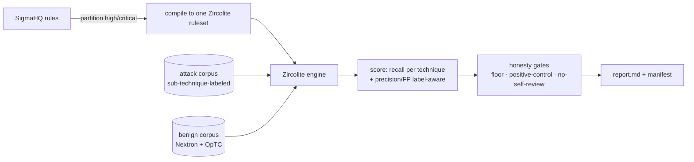

# sigmaforge

**Honest Sigma-rule backtest harness.** Measures detection rules against real log
corpora and reports two numbers per rule — **recall** (does it catch attacks of its
ATT&CK sub-technique?) and **precision / false-positives** (does it fire on benign
activity?) — with honesty gates that return `unmeasured` instead of a fake `0` or a
tautological `1.0` when the data can't support a number.

[](https://github.com/duathron/sigmaforge/actions/workflows/ci.yml)


> [!NOTE]
> **Learning / portfolio project, built by directing AI coding agents.** Christian
> Huhn (photography → SOC career change) designed, reviewed, and gated the work; the
> implementation was AI-pair-programmed. It is an honest measurement harness, not a
> polished product — see *Status* below for exactly what works and what doesn't yet.

## What problem it solves

Every SOC ships dozens to hundreds of detection rules and rarely measures them.
sigmaforge answers two questions with reproducible evidence:

- **Which rules are noise generators?** (high false-positives on legitimate activity)
- **Which rules catch nothing?** (zero recall against real attacks of their technique)

Example finding from a real run: *Suspicious Windows Service Tampering* produced 66
false-positives on a benign corpus — every one a Ninite / TeamViewer installer, not
an attack.

## How it actually works



The real pipeline is **script-driven** (`scripts/run6_backtest.py` is the current
end-to-end path):

```bash
uv run python scripts/compile_loaded_ruleset.py   # rules -> one Zircolite ruleset
uv run python scripts/run6_backtest.py            # backtest -> reports/run6.md
```

> [!WARNING]
> The shipped CLI (`sigmaforge backtest`) is a **weaker, work-in-progress path** and
> is not the way the real reports were produced. Use the scripts above. The CLI is
> kept for the future one-command experience, not parity.

## Status

| Area | State |
|------|-------|
| Recall (per sub-technique, no sibling dilution) | **Working** — 338/609 rules measurable, 70 fire (run5) |
| Precision / false-positives (label-aware, gated) | **Working** — 7/609 measurable on current benign corpus (run6) |
| Honesty gates (floor, positive-control, no-self-review) | **Working** |
| Reproducible manifest (run_hash, corpus SHAs, provenance) | **Working** |
| One-command CLI (`sigmaforge backtest`) | **WIP** — weaker than the scripts |
| Self-generated benign corpus | **Kit ready** (`scripts/selfgen/`), needs a Windows VM run |

> [!IMPORTANT]
> **The log corpora are not shipped.** They are large, separately licensed, and
> gitignored. `pip install sigmaforge` installs the harness code, not the data — a
> full end-to-end backtest needs the corpora and a local Zircolite checkout (also not
> bundled). The package is useful as a library / reference; the runnable pipeline
> needs the local setup documented in `scripts/`.

## Install

```bash
pip install sigmaforge
```

Installs the harness package and the `sigmaforge` CLI. The detection engine
([Zircolite](https://github.com/wagga40/Zircolite)) and the log corpora are obtained
separately (see above).

## Corpora used (all verified, portfolio-safe licenses)

| Corpus | Role | License |
|--------|------|---------|
| [splunk/attack_data](https://github.com/splunk/attack_data) | recall (sub-technique-labeled attacks) | Apache-2.0 |
| [DARPA OpTC](https://github.com/FiveDirections/OpTC-data) | precision (real enterprise benign week) | Public domain |
| [NextronSystems/evtx-baseline](https://github.com/NextronSystems/evtx-baseline) | precision (goodware baseline) | Apache-2.0 |
| Self-generated (`scripts/selfgen/`) | precision (targeted admin/LOLBin noise) | your own lab |

## Reproduce a backtest from a clone

The pip package is the library/CLI; a full end-to-end backtest needs the engine and
corpora, which are not bundled (engine = large third-party tool; corpora = large and
separately licensed). To go from a fresh clone to a runnable backtest:

```bash
uv sync --group backtest          # script deps (pyyaml, evtx, gdown)
bash scripts/setup_engine.sh      # fetch Zircolite 3.7.6 + its runtime deps
```

Then obtain the corpora (see the table above) into `~/sigmaforge-v0/` and build the
combined samples with the `scripts/build_*_benign.py` / `scripts/build_*_corpus.py`
helpers, compile the ruleset, and run a backtest:

```bash
uv run python scripts/compile_loaded_ruleset.py   # SigmaHQ rules -> one Zircolite ruleset
uv run python scripts/run7_backtest.py            # -> reports/run7.md (+ manifest)
```

Run scripts from the repo root (the engine working dir defaults to the current
directory; override with `SIGMAFORGE_HOME` if you keep `Zircolite/` elsewhere). The
`reports/run*.md` + `*_manifest.json` are committed so the results are inspectable
without re-running.

## Development

Built with the [Shipwright](https://github.com/duathron/shipwright) dev framework.

```bash
uv sync --dev
uv run pytest        # 110 tests (engine smoke test skips without Zircolite)
uv run ruff check .
```

## License

MIT © Christian Huhn. Corpus data retains its upstream license (see table above).
